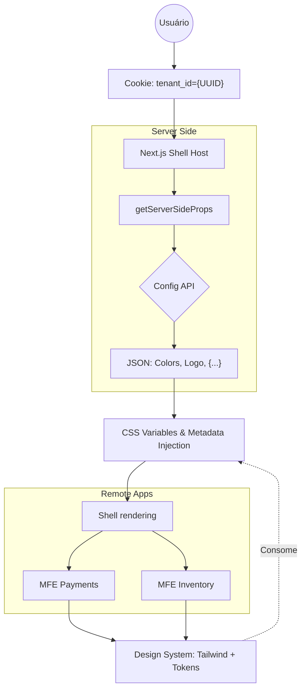

# Estratégia Arquitetural: CMS White Label & Microfrontends

Ecossistema de microfrontends whitelabel escalável, com _Server Side Rendering_ e _Server Side Props_ baseada em cookie de multi tenância. Microfrontends baseados em Module Federation orquestrados em Next.js. A estratégia de White Label e a localização são resolvidas integralmente no SSR via cookie de sessão, garantindo que dados sejam injetados antes da renderização, otimizada para Core Web Vitals.

## 2. Decisões Técnicas e Trade-offs

### 2.1 Orquestração SSR (Next.js & Module Federation)

A aplicação shell roda um Next.js que orquestra as rotas via Pages Router em vez do App Router, que apesar de mais moderno e comum no mercado, ainda não é completa e oficialmente suportado para Module Federation com SSR.

### Whitelabel com Tailwind CSS + Variáveis CSS

A identificação do tenant é realizada via cookie de sessão. O servidor identifica o cliente no `getServerSideProps`, consome a API de configuração e injeta os tokens de marca e o dicionário de idiomas no ciclo de renderização. Assim a customização visual é agnóstica ao build, permitindo escalabilidade sem re-deploy.

Para isolar o CSS e evitar colisões, cada MFE deve configurar um prefixo para os estilos do Tailwind (ex: ao invés de `bg-blue`, usar `settings-bg-blue-500`), isso é feito via propriedade `prefix` no `tailwind.config.js`. A unicidade dos prefixos deve ser feita passivamente de preferência seguindo o mesmo nome do microfrontend.

O Shell injeta um bloco de variáveis CSS no `<head>` (ex: `--color-primary`), que são consumidas pelo Tailwind, mantendo a consistência visual entre todos os microfrontends. Breaking-changes nos tokens de design system deverão ser retrocompatíveis com fallbacks, preferencialmente sempre com nomenclaturas genéricas, ex: `--color-primary`, `--color-secondary`, `--font-size-base`, etc.

### Personalização semântica e de idiomas

A internacionalização pode também suportar múltiplos tenants e personalizações semânticas. O Shell carrega primeiramente o dicionário customizado do tenant e utiliza um dicionário global como fallback para termos não customizados, para aumentar a capacidade de personalização encapsulada por tenant.

### Gestão de Código em Monorepo

O gerenciamento do monorepo é feito com Turborepo, isso permite que múltiplos times trabalhem em aplicações isoladas (`apps/*`) e bibliotecas compartilhadas (`packages/*`) com pipelines independentes, otimizando o tempo de build e a produtividade.

## Estratégia de Colaboração

Para viabilizar que múltiplos times trabalhem em funcionalidades com autonomia:

O shell utiliza um mecanismo de Service Discovery em tempo de execução. Em vez de URLs estáticas, ele consome um manifesto de remotos. Isso permite que um time realize o deploy de uma nova versão de um MFE e o shell a descubra automaticamente, sem necessidade de um novo build do Host. Caso o manifesto remoto esteja offline ou corrompido o shell utiliza um manifesto de segurança "hardcoded" com as versões estáveis conhecidas (LTS) dos microfrontends mínimos.

A localização dos microfrontends é injetada via variáveis de ambiente (`REMOTE_MANIFEST_URL`) para que a mesma imagem possa ser usado em todos os ambientes (Local, Homolog, Produção, etc) sem alterações no código, apenas apontando para o Service Discovery correspondente de cada infraestrutura. No futuro seria possível identificar (por pings, o melhor ambiente dependendo do ambiente do shell e usar fallbacks e garantir confiabilidade nos testes e validações manuais).

O shell atua como um orquestrador de layout, expondo "Slots" onde os módulos remotos são montados via Lazy Loading, otimizando Core Web Vitals.

Interações entre microfrontends ocorrem via Custom Events no DOM. O shell funciona como um Event Bus, garantindo que os remotos notifiquem ações (ex: `payment:complete`) sem acoplamento direto de código.

A biblioteca de componentes deve ser distribuída via NPM com Versionamento Semântico para que cada time valide novas versões em seus remotes antes de uma migração global, eliminando o risco de breaking changes e também permitindo atualizações incrementais na plataforma como um todo.

## Abstração de Componentes Complexos

Componentes complexos devem ser montados com API declarativa (ex: `<Chart.Bars />`, `<Chart.Tooltip />`), permitindo que o desenvolvedor controle total sobre a composição. O componente também deve ser agnóstico à estrutura de dados do backend utilizando um adaptadores para transformar payloads de diferentes APIs em um schema padronizado, protegendo a interface de mudanças em contratos de API.

## Governança e Qualidade

O pacote de design system utiliza o Storybook para isolar o desenvolvimento de componentes e documentar visualmente. Isso permite que os desenvolvedores testem variações de temas e estados de forma independente das aplicações de negócio, com contratos de implementação claros e documentados.

A ferramenta `axe-core` no ciclo de desenvolvimento e testes para um whitelabel dinâmico atua como uma trava de segurança  validando se as propriedades de acessibilidade definidas pelo tenant mantêm compatibilidade com WCAG, incluindo contraste de cores.

O uso de versionamento semântico em todos os pacotes compartilhados é obrigatório, garantindo previsibilidade e segurança nas atualizações de dependências entre os times.

## Observabilidade e Resiliência

O shell usa Error Boundaries nos pontos de montagem dos remotes para que falhas em um microfrontend específico não quebrem a plataforma como um todo e possam ser tratados adequadamente.

Implementação de distributed tracing em todas as chamadas SSR para  rastrear o ciclo de vida de uma requisição desde o shell até às APIs de configuração e aos remotos para debug de sistema complexo.

As configurações de tenant devem ser gerenciadas com cache no SSR para otimizar o tempo de resposta e reduzir carga nas APIs e garantir alta disponibilidade sob carga.

A monitorização dos indicadores de performance de Core Web Vitals do shell deve ser feita de forma passiva para identificar remotos que possam estar impactando negativamente.

## Containerização e Infraestrutura

Cada aplicação possui seu próprio container no monorepo. Dockerfile separa as etapas de instalação de dependências, build e execução para reduzir o tamanho da imagem final.

Para desenvolvimento local, o Docker Compose orquestra o shell, os Microfrontends e um mock da API de Configuração, garantindo que o ambiente de desenvolvimento seja idêntico ao de produção.

Cada container expõe sua porta específica e consome as variáveis de ambiente necessárias para localizar o `remote-manifest.json`, permitindo que o escalonamento horizontal seja feito de forma independente por funcionalidade (ex: escalar apenas o MFE de Pagamentos em dias de pagamento).
