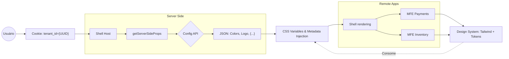

# Estratégia Arquitetural: CMS White Label & Microfrontends

Ecossistema escalável de microfrontends (MFEs) White Label, utilizando **Module Federation** orquestrado por **Next.js** com injeção de multi-tenância via SSR.



## Stack Tecnológica de Referência
- **Node.js v22 (LTS):** Estabilidade e performance para SSR.
- **Next.js v15 (Pages Router):** Estabilidade madura com Module Federation e SSR.
- **React v19:** Suporte nativo a metadados e Web Components.
- **Turborepo:** Gestão de monorepo e pipeline de build otimizado.

## Estrutura do Projeto

```
.
├── apps/
│   ├── shell/              # Host Principal
│   ├── mfe-remote/         # Microfrontends Remotos
├── packages/
│   ├── ui/                 # Design System
│   ├── tailwind-config/    # Configuração compartilhada Tailwind + CSS Variables
│   ├── eslint-config/      # Configurações de Lint
│   ├── typescript-config/  # Configurações de TS base
│   └── utils/              # Lógicas globais
├── docker-compose.yml      # Orquestração de containeres
└── turbo.json              # Configuração do monorepo
```

## Decisões Técnicas

Detalhamento das decisões técnicas:
- [Monorepo/Turborepo](./docs/MONOREPO.md)
- [Federation/Module Federation](./docs/FEDERATION.md)
- [Styles/Tailwind](./docs/STYLES.md)

### Orquestração de Desenvolvimento com Turborepo
- **Execução Paralela:** Apps com prefixo `mfe-*` rodam em paralelo via configuração `dev#apps/mfe-*`
- **Dependências Automáticas:** Shell aguarda conclusão de todos os MFEs através de `dependsOn: ["^apps/mfe-.*#dev"]`
- **Escalabilidade:** Novos apps MFE são automaticamente incluídos no pipeline sem configuração manual
- **TypeScript:** Declarações de módulo `mfe-{remote-name}/*` para tipagem segura de imports dinâmicos

### Estilização whitelabel com Tailwind CSS
A customização é agnóstica ao build via SSR, utilizando Tailwind CSS + Variáveis CSS compartilhadas.

- **Pacote Compartilhado:** `@repo/tailwind-config` centraliza configuração Tailwind, CSS variables e PostCSS
- **Classes Semânticas:** `bg-primary`, `text-primary-foreground`, `bg-secondary` com contraste WCAG garantido
- **Design System:** Paleta slate (cinza azulado) com suporte a light/dark mode
- **Performance:** Configurações de tenant cacheadas no servidor

### Comunicação e Desacoplamento (Event Bus Tipado)
- **Event Bus:** Interação entre MFEs via *Custom Events* nativos do DOM, garantindo que o Shell atue como um orquestrador neutro.
- **Type Safety (@repo/utils):** Implementação de um helper centralizado que tipa os eventos globais. Isso garante que um MFE de Pagamentos não emita eventos desconhecidos e que o Shell ou outros remotos assinem apenas contratos válidos.
- **Slots:** Áreas de montagem carregadas via *Lazy Loading* e protegidas por `ErrorBoundary`.

### Qualidade e Governança
- **Design System:** Componentes isolados no Storybook e validados com `axe-core` para acessibilidade (WCAG).
- **Versionamento:** Uso rigoroso de **SemVer** para pacotes compartilhados, permitindo atualizações incrementais e seguras.
- **Observabilidade:** *Distributed Tracing* em chamadas SSR para rastrear o ciclo de vida da requisição multi-tenant.

### Infraestrutura
Cada aplicação possui seu próprio `Dockerfile` multi-stage. O `docker-compose.yml` local orquestra o ecossistema completo (Shell, Remotos e API Mock), garantindo paridade entre os ambientes de desenvolvimento e produção.

### CI/CD Pipeline
- **GitHub Actions:** Pipeline manual com suporte a build seletivo por projeto ou completo para todo o monorepo.
- **Node.js v22:** Ambiente de build padronizado com cache de dependências npm para otimização.
- **Turborepo:** Execução de builds com controle de concorrência (`--concurrency=1`) para garantir estabilidade.
- **Build Seletivo:** Opção de build individual por projeto (`shell`, `mfe-remote`) ou build completo (`all`).
- **Variáveis de Ambiente:** Configuração otimizada com `NEXT_PRIVATE_LOCAL_WEBPACK` e `NODE_OPTIONS` para gerenciamento de memória.
