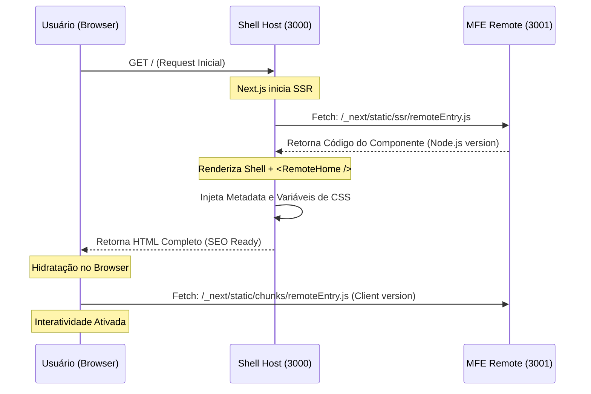

# Module Federation: Guia de Implementação

## Overview

O projeto usa **Module Federation** para criar microfrontends (MFEs) onde múltiplas aplicações Next.js podem compartilhar código e componentes, para manter independência de desenvolvimento e deploy.

## Arquitetura Atual



## Configuração do Shell (Host)

### `apps/shell/next.config.js`

```javascript
...
  remotes: {
    'mfe-{name}': `mfe-{name}@//domain/path/to/remote/${options.isServer ? 'ssr' : 'chunks'}/remoteEntry.js`,
    ...
  },
...
```

### Consumo de Componentes Remotos

```typescript
import dynamic from 'next/dynamic'

const RemoteComponent = dynamic(() => import('mfe-{remote}/{Component}'), { ssr: true })

...

<RemoteComponent />
```

### Tipagem TypeScript

```typescript
// apps/shell/types/remote.d.ts
type MFE = React.FC

declare module 'mfe-remote/*' {
  const Component: MFE
  export default Component
}
```

## Configuração do Remote (mfe-remote)

### `apps/mfe-remote/next.config.js`

```javascript
...
new NextFederationPlugin({
  name: 'mfe-{name}',
  filename: 'static/chunks/remoteEntry.js',
  exposes: {
    './{Component}': './components/{Component}',
  },
  shared: {
    react: { singleton: true, requiredVersion: false, eager: true },
    'react-dom': { singleton: true, requiredVersion: false, eager: true },
  },
}),
...
```

## Configuração do Turborepo

### `turbo.json`

```json
{
  "tasks": {
    "dev": {
      "cache": false,
      "persistent": true
    },
    "dev#apps/mfe-*": {
      "cache": false,
      "persistent": true
    },
    "dev#shell": {
      "cache": false,
      "persistent": true,
      "dependsOn": ["^apps/mfe-.*#dev"]
    }
  }
}
```

**Benefícios desta configuração:**
- Apps `mfe-*` rodam em paralelo
- Shell aguarda conclusão dos MFEs
- Escalabilidade automática para novos apps

## Vantagens do Module Federation
- Cada MFE pode ser deployado independentemente
- Versionamento semântico por aplicação
- Rollbacks granulares por microfrontend

### Compartilhamento de Dependências
```javascript
shared: {
  react: { singleton: true, requiredVersion: false, eager: true },
  'react-dom': { singleton: true, requiredVersion: false, eager: true },
}
```
- Evita duplicação de React/DOM
- Reduz bundle size significativamente
- Mantém versões consistentes

### SSR Compatibility
- Suporte completo a Server-Side Rendering (até o NextJS 15)
- Hydration correta em ambiente cliente
- Performance otimizada com `eager: true`

### Hot Module Replacement
```javascript
extraOptions: { enableHmr: true }
```
- Desenvolvimento em tempo real
- Mudanças refletem instantaneamente
- Debugging simplificado

### Type Safety
- Declarações de módulo específicas
- Autocompletar no IDE
- Refactoring seguro

## Comparação com Outras Abordagens

### vs. Iframes

| Característica | Module Federation          | Iframes                     |
| -------------- | -------------------------- | --------------------------- |
| Performance    | ✅ Alto (compartilhamento) | ❌ Baixo (isolamento total) |
| SEO            | ✅ Full SSR                | ❌ Limitado                 |
| Comunicação    | ✅ Eventos, imports        | ❌ postMessage complexo     |
| Estilos        | ✅ Global controlado       | ❌ Isolamento rígido        |
| Debugging      | ✅ DevTools unificado      | ❌ Contextos separados      |

### vs. NPM Packages

| Característica | Module Federation | NPM Packages            |
| -------------- | ----------------- | ----------------------- |
| Deploy         | ✅ Independente   | ❌ Sincronizado         |
| Versionamento  | ✅ Runtime        | ❌ Build-time           |
| Hot Reload     | ✅ Instantâneo    | ❌ Rebuild necessário   |
| Bundle Size    | ✅ Otimizado      | ❌ Potencial duplicação |

### vs. Microservices Frontend

| Característica | Module Federation | Microservices       |
| -------------- | ----------------- | ------------------- |
| Complexidade   | ✅ Baixa          | ❌ Alta             |
| Performance    | ✅ Alto           | ❌ Network overhead |
| SSR            | ✅ Nativo         | ❌ Complexo         |
| Tooling        | ✅ Next.js        | ❌ Custom           |

## Melhores práticas

### Convenção de Nomes
- Prefixo `mfe-` para todos os remotes
- Nome consistente entre package.json e Module Federation
- Ex: `mfe-remote`, `mfe-dashboard`, `mfe-auth`

### Estrutura de Pastas
```
apps/
├── shell/
├── mfe-remote/
│   ├── components/
│   │   └── Home.tsx
│   └── pages/
└── mfe-dashboard/
    ├── components/
    └── pages/
```

### Exposes Strategy
```javascript
exposes: {
  './Home': './components/Home',      // Componentes
  './utils': './lib/utils',          // Utilitários
  './hooks': './hooks/useAuth',      // Hooks custom
}
```

### Compártilhamento de dependências
```javascript
shared: {
  react: { singleton: true, requiredVersion: false, eager: true },
  'react-dom': { singleton: true, requiredVersion: false, eager: true },
  '@repo/ui': { singleton: true, requiredVersion: false },
}
```

### Error Boundaries
```typescript
const RemoteComponent = dynamic(() => import('mfe-remote/Home'), {
  ssr: true,
  loading: () => <div>Carregando...</div>,
})

// Com Error Boundary
<ErrorBoundary fallback={<div>Falha no carregamento</div>}>
  <RemoteComponent />
</ErrorBoundary>
```
